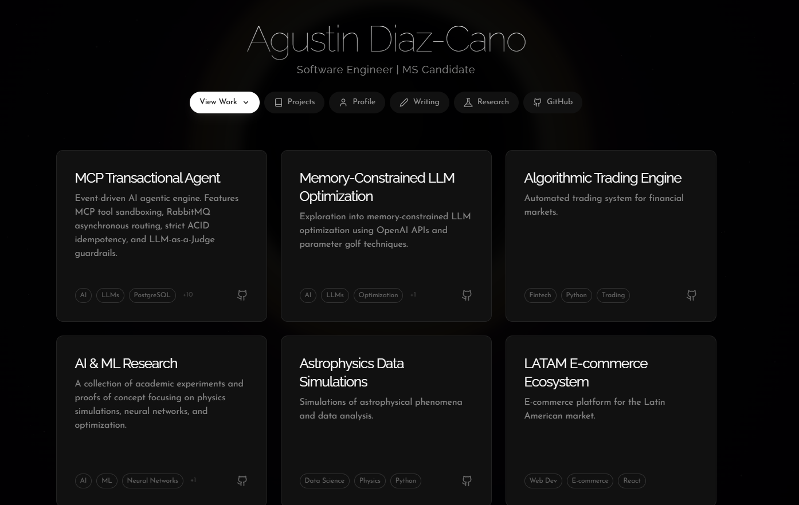
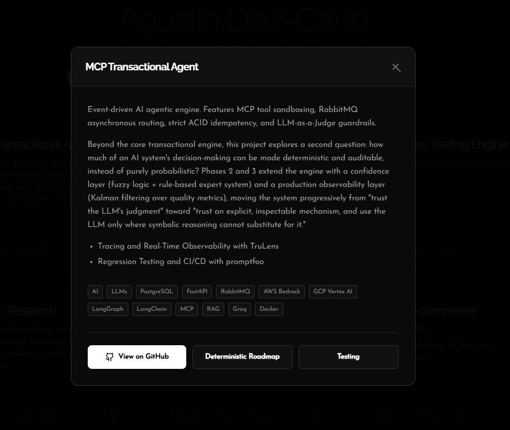
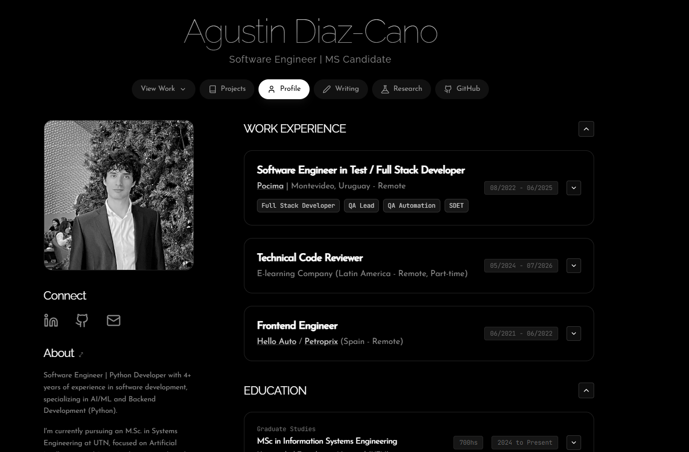
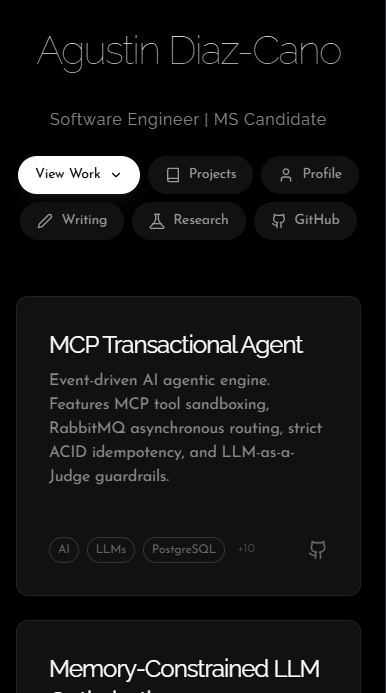
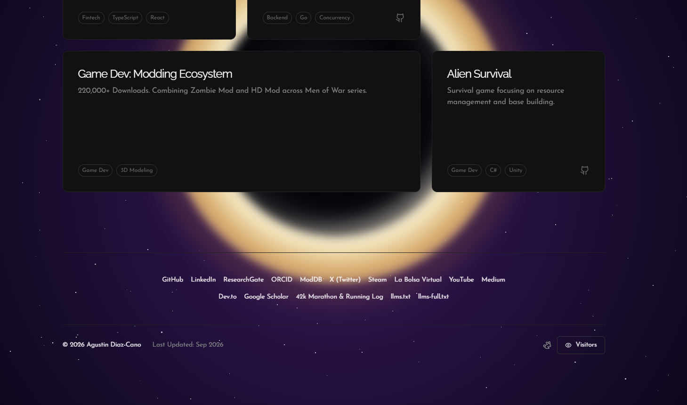
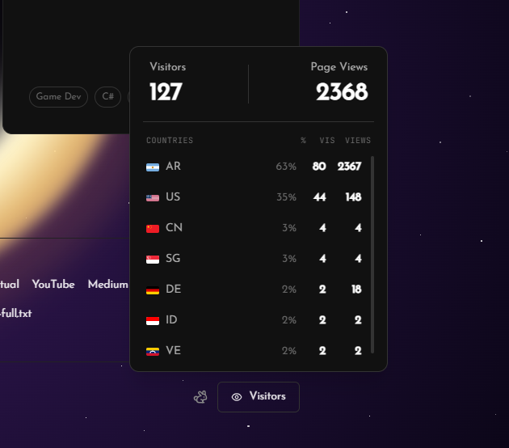

# Portfolio of Agustin Diaz-Cano — [agustindiazcano.com](https://www.agustindiazcano.com)

Personal portfolio and technical blog built with Astro 5, React 19, and Tailwind CSS v4. Showcases engineering work across backend systems, distributed architectures, AI/ML optimization, and independent simulations.

Live site: [agustindiazcano.com](https://www.agustindiazcano.com)

---

## Previews

<div align="center">
  
</div>

<br />

| Bento Grid & Modal Details | Profile & Background |
| :---: | :---: |
|  |  |

| Mobile Responsive Experience | Interactive Footer & Live Analytics |
| :---: | :---: |
|  |  |

<div align="center">
  
</div>

---

## Project Structure

```text
/
├── .github/workflows/      # CI/CD (weekly analytics sync, etc.)
├── public/                 # Static assets (images, favicon, llms.txt, llms-full.txt)
├── scripts/                # Automated maintenance scripts (fetch-analytics.mjs)
├── src/
│   ├── components/         # Astro and React 19 interactive components
│   ├── data/               # Static data and weekly analytics records
│   ├── layouts/            # Base page layouts
│   ├── pages/              # File-based routing
│   │   ├── cv.astro        # Curriculum Vitae / Summary
│   │   ├── github.astro    # GitHub repositories & contribution analytics
│   │   ├── index.astro     # Home page (interactive bento grid & CSS black hole)
│   │   ├── profile.astro   # Profile and personal background
│   │   ├── projects.astro  # Projects showcase catalog
│   │   ├── research.astro  # Academic & applied research publications
│   │   ├── running-agustin-diaz-cano.astro # Marathon & running race logs
│   │   ├── writing.astro   # Articles and publications index
│   │   ├── projects/       # Individual project detail pages
│   │   ├── research/       # Individual research detail pages
│   │   └── writing/        # In-depth technical articles
│   ├── styles/             # Global styles and Tailwind CSS v4 tokens
│   └── utils/              # Helper utilities (analytics aggregators, etc.)
├── astro.config.mjs        # Astro configuration and integrations
├── package.json            # Dependencies and scripts
├── tsconfig.json           # TypeScript configuration
└── vercel.json             # Vercel deployment, headers, and redirects
```

- `src/pages/projects/` — Individual project deep-dives (Transactional Agents, LLM Optimization, Trading Engines, etc.)
- `src/pages/research/` — Academic research and experimental systems
- `src/pages/writing/` — Technical articles, algorithmic breakdowns, and engineering essays
- `src/data/analytics/` — Snapshot records and weekly Vercel Web Analytics data
- `vercel.json` — Deployment config, including canonical domain redirects and security headers

## Commands

| Command                   | Action                                           |
| :------------------------ | :----------------------------------------------- |
| `npm install`             | Installs dependencies                            |
| `npm run dev`             | Starts local dev server at `localhost:4321`      |
| `npm run build`           | Build production site to `./dist/`               |
| `npm run preview`         | Preview build locally before deploying           |

## Stack

Astro · Vercel · deployed with canonical domain enforcement (non-www) and 
CSP/HSTS security headers.

## Contact

- LinkedIn: [linkedin.com/in/agustindiazcano](https://linkedin.com/in/agustindiazcano)
- GitHub: [github.com/agustindiazcano](https://github.com/agustindiazcano)